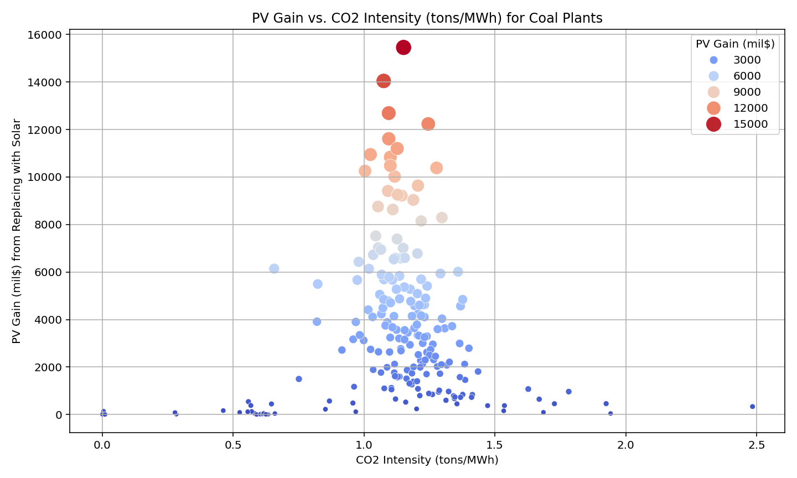
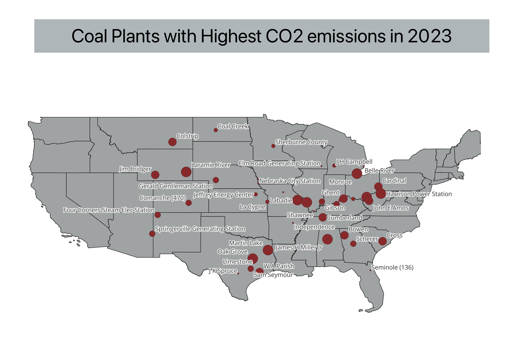
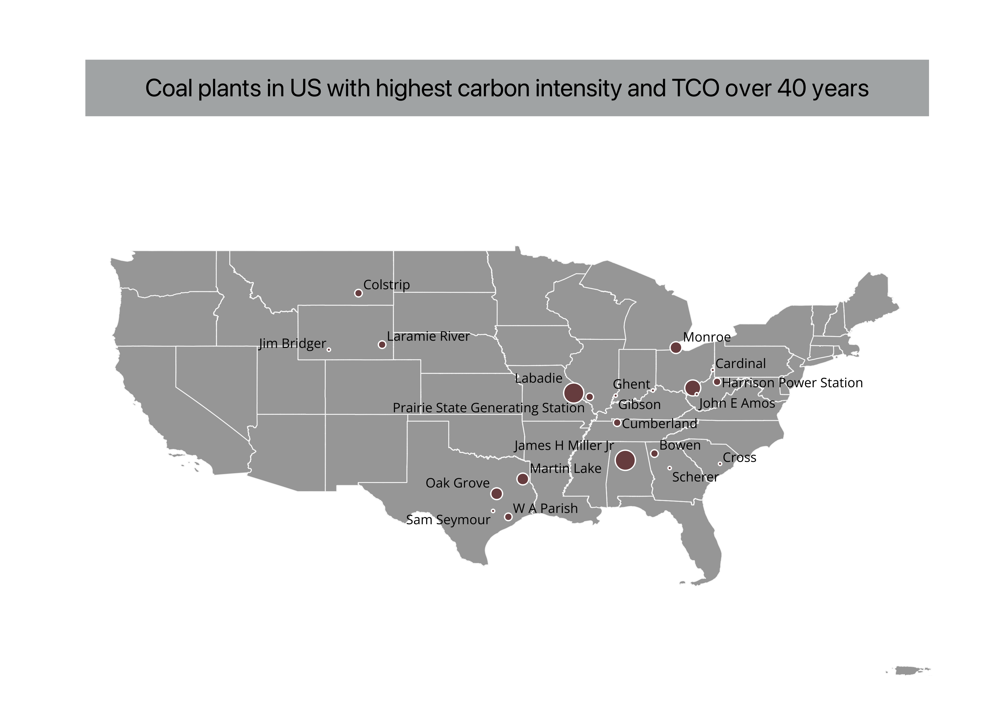

# Present Value analysis for replacing coal plants with solar plants in US over 40 years period

# 1. Key Questions

1. How much CO2 can be avoided if coal plants in US are replaced with renewable energy RE power plants – solar plants?
2. What is the PV gain over 40 years period if coal plants are to be replaced with solar plants?

# 2. Summary
This project examines the financial and environmental benefits of replacing existing coal-fired power plants in the United States with solar photovoltaic (PV) systems. Using plant-level data from the EPA’s eGRID 2023 database, the study calculates the Present Value (PV) of operating coal plants versus switching to solar across a 40-year timeline. The analysis incorporates key cost elements such as capital expenditure, fuel and operations & maintenance costs, investment tax credits, and the social cost of carbon (SCC). Each plant’s annual generation and emissions were modeled to determine the breakeven point and potential gains in avoided CO₂ emissions. The final output includes a spatially referenced dataset and maps of coal plants needed to be prioritized due to thier high carbon intensity and present value gain that visualize plant-level PV gains and environmental impact for use in GIS-based policy planning.

# 3. Problem Statement

As of early 2025, U.S. coal-fired power plants emitted approximately 137.5 million tons of pollutants, contributing to toxic PM2.5 particles, mercury, and arsenic contamination. These emissions pose serious health and environmental risks, especially in communities near outdated coal infrastructure. This project investigates a central question:
By evaluating the long-term economic and emissions impacts of transitioning from coal to solar, the analysis aims to inform smarter investment decisions and accelerate the clean energy transition.

# 4. Input Data
This analysis draws on multiple publicly available datasets and cost assumptions from U.S. government sources:

1. EPA eGRID 2023 Data [egrid 2023 data](egrid2023_data_rev1.xlsx)

    Source: U.S. Environmental Protection Agency (EPA)

    Dataset: Emissions & Generation Resource Integrated Database (eGRID)
    
    File Used: eGRID2023_Data_Rev1.xlsx
    
    Sheet Referenced: PLNT23 (plant-level data)
    
    Content: Includes plant nameplate capacity, annual CO₂ emissions, location (lat/lon), fuel type, and capacity factor.

2. U.S. Census TIGER/Line Shapefiles [here](tl_2024_us_state.zip)

    Source: U.S. Census Bureau
    
    Dataset: Cartographic Boundary Files – U.S. States
    
    File Used: cb_2022_us_state_20m.zip (used for spatial joins in QGIS)
    
    Purpose: Enables state-level spatial aggregation and mapping of NPV gain and CO₂ reduction potential.

3. Electricity Cost & Performance Assumptions
    
    Source: U.S. Energy Information Administration (EIA)
    
    Document: “Assumptions to the Annual Energy Outlook 2024”
    
    File Referenced: elec_cost_perf.pdf
    
    Used For: Coal heat rate and O&M cost, Solar PV capital expenditure (CAPEX), O&M, and capacity factor

    Used as core inputs in NPV calculations
    
    You can get access to the source file [here.](elec_cost_perf.pdf)

# 5. Scripts in order
1. [CO2avoided.py](CO2avoided.py)

    The purpose of this script is to calculate the total tons of CO2eq 
that can be avoided in 2023 year alone, ranking top 20% (dirtiest) of 
coal plants with highest CO2eq tons emissions, and monetized the emission as social cost of carbon - SCC.  Then, the csv file created was used to locate the coal plants with highest CO2eq emissions in QGIS in US Map.

2. [PV.py](PV.py)

    The purpose of the script is to calculate the total cost of operations - TCO for both coal plant and solar plant for over 40 years period. This script evaluates the financial and environmental trade-offs of replacing U.S. coal-fired power plants with solar photovoltaic (PV) systems. For each coal plant, it calculates the total cost of ownership (TCO) over a 40-year horizon, accounting for fixed and variable O&M costs, fuel costs, and the social cost of carbon (SCC). It then models the equivalent solar plant size needed to replace the coal plant’s generation, computes the associated solar TCO (including capital costs, ITC, O&M, and degradation-adjusted costs), and compares both TCOs. Here, the cost of land to build the solar is not included with the assumption that it will be build on the land plot of current coal plant.

3. [analysis.py](analysis.py)

    This script analyzes the relationship between CO₂ intensity and the economic benefits (PV Gain) of replacing U.S. coal power plants with solar. Then, it identifies a subset of coal plants that are both high in CO₂ intensity (>1.0 tons/MWh) and show significant economic advantage when replaced with solar (PV Gain > $8 billion). A scatter plot is generated to visualize the correlation between CO₂ intensity and PV Gain, and the correlation coefficient is calculated. Finally, the filtered dataset with high-priority coal plants are exported for further mapping in QGIS.

# 6. Outputfiles and QGIS Maps
## CSV files
1. 'coalPP_US.csv' and 'top20_dirtiest coal plants.csv' from first script 'CO2avoided.py' are used as input layers to produce the distribution of coal power plants across US in QGIS.
2. "coal_to_solar_pv_gain.csv" from second script 'PV.py' is used in the third script 'analysis.py' for further analysis.
3. 'analysis.y' script produce one graph (pv_vs_CO2_intensity.png) about the correleration between carbon intensity and present value gain for all coal plants in US, one csv file 'pv_CO2_intensity_analysis.csv' which is then filtered to produce coal plants whose carbon intensity is higher then 1 and PV gain higher then 8 billion $. The filtered csv 'filtered_by_highest_TCO.csv' is used to demonstrate coal plants to be considered to replace in QGIS map in the states they are located with the name of the coal plant.

## Maps
1. Coal Power Plants in US.

2. Coal Power Plants with highest CO2eq emissions.

3. Coal Plants with highest carbon intensity and Total Cost of Operation over 40 years.

# 7. Results and Analysis
The analysis of the plant-level PV calculations reveals that the economic viability of replacing coal power plants with solar installations is highly sensitive to key policy levers, specifically, the Investment Tax Credit (ITC) and the Social Cost of Carbon (SCC). When the federal 30% ITC is applied, the present value cost of solar projects is significantly increased, making the transition economically attractive in most cases. However, when the ITC is removed from the model, many solar replacements no longer yield a positive PV gain, indicating that without these tax incentives, private investors are unlikely to pursue utility-scale solar projects at the scale needed to replace coal generation.

On the other side of the equation, applying the SCC to coal plants,  monetizing the external damages of CO₂ emissions — dramatically increases the total cost of ownership of coal-fired power generation. Without including the SCC, the cost advantage of switching to solar diminishes, weakening the case for replacement from a financial standpoint. This underlines a critical policy gap: while solar is clean and increasingly cost-competitive, coal remains artificially cheaper unless its full social and environmental costs are internalized. Therefore, policymakers must consider strategies to either enforce a carbon price or expand SCC related accounting into regulatory and investment decisions. Together, these findings underscore the importance of combining financial incentives for renewables with mechanisms that reflect the true cost of fossil fuel emissions.

# 8. Limitations and Further Research

While the analysis provides a robust plant-level comparison of coal and solar total cost of ownership, several important factors were excluded due to data constraints. Notably, the cost of land acquisition for utility-scale solar installations was not included, which can be significant in high-value or spatially constrained regions. Additionally, the model does not account for revenue streams from selling electricity, which would normally offset some of the solar capital and operational costs over time. By omitting these inflows, the analysis takes a conservative stance on solar economics. For further research, integrating market-based electricity price forecasts, locational marginal pricing, and potential revenue from renewable energy credits (RECs) would improve financial realism. Spatial analysis of suitable solar siting areas using land use data, grid interconnection proximity, and social equity overlays could also enhance the planning framework for targeted coal-to-solar transitions.